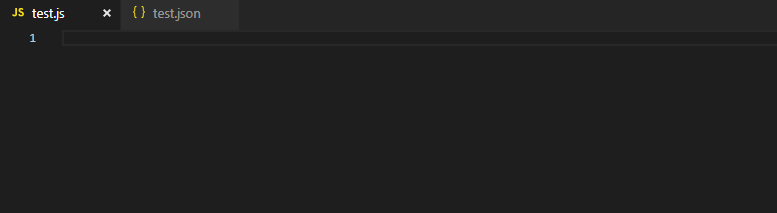
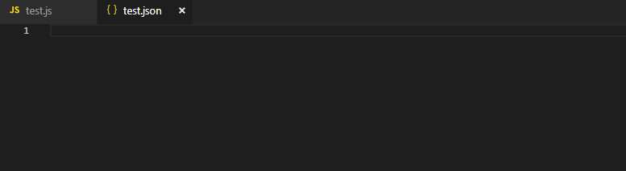

# LDSSnippets README

Snippets for common LS and LO tasks in VS Code

## Features

Describe specific features of your extension including screenshots of your extension in action. Image paths are relative to this README file.

### Insert common JavaScript commands into your code:

### Insert common configuration lines in XML or JSON:

> The list of file types and associated code/config snippets can grow easily

## Requirements

Visual Studio Code 1.26 or better

## Extension Settings

None

Just type <i>!ls</i> in the appropriate file type and see the fill list of LS snippets avavilable

## Current Snippets:

### JavaScript

* `!LSno `: LDS.PageObjects.notifyObservers();

### Configuration
#### JSON
* `!LSiclf `: Image Capture Line - Full  (with startTime, Frequency, and endTime)
* `!LSicls `: Image Capture Line - Short (with startTime only)

## Known Issues

None

## Release Notes

Users appreciate release notes as you update your extension.

### 1.0.0

Initial release of LDS Snippets